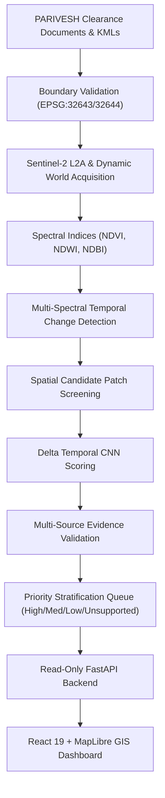

# VanDrishti

## Environmental Clearance Disturbance Monitoring System

VanDrishti is a spatio-temporal satellite and AI-based framework for screening land-surface changes around environmentally approved projects. It combines validated project boundaries, Sentinel-2 imagery, Dynamic World land-cover information, spectral change analysis, and a temporal CNN to prioritize candidate disturbance areas for human investigation.

> **Scientific & Scope Disclaimer**: VanDrishti is an AI-assisted decision-support system intended for spatial candidate screening and priority ranking. System predictions and satellite indicators represent candidate anomaly signals and supporting proxy evidence. The system does **not** establish illegal activity, environmental violations, causality, intent, or legal non-compliance, and does **not** replace on-ground regulatory inspections.

---

## Overview

Environmental clearance orders granted by regulatory bodies define approved project boundaries, land-use commitments, and environmental safeguards. However, systematically monitoring multi-year land-surface changes within and surrounding these approved project areas across vast geographic landscapes poses significant manual inspection challenges for environmental analysts.

VanDrishti addresses this challenge by providing an automated, transparent spatio-temporal screening pipeline. By integrating multi-spectral Sentinel-2 satellite observations and Google Dynamic World land-cover data, the system detects statistically significant multi-year spectral and land-cover changes, scores spatial patch candidates using a deep spatio-temporal neural network, and categorizes candidate hotspots into an investigator priority queue.

The resulting web-based decision-support system enables environmental investigators to filter, visualize, and review prioritized candidate disturbance hotspots alongside multi-temporal satellite rasters, spectral indices, and model provenance metadata.

---

## Key Capabilities

- **Boundary Validation**: Topological checking and UTM metric reprojection of PARIVESH clearance boundaries.
- **PARIVESH Document & Spatial Inventory**: Automated cataloging of Stage-I/II clearance orders, DGPS maps, and KML geometries.
- **Sentinel-2 Multi-Spectral Processing**: Seasonal dry-season median compositing across 6 spectral bands (B2, B3, B4, B8, B11, B12).
- **Dynamic World Land-Cover Reference**: Integration of 9-class annual mode land-cover classifications.
- **Spectral Index Analysis**: Calculation of polygon-masked NDVI, NDWI, and NDBI indices and annual delta trends.
- **Multi-Year Temporal Change Detection**: Identification of multi-spectral anomaly candidate pixels across consecutive annual transitions.
- **Spatial Candidate Screening**: 8-neighbor spatial clustering and candidate patch generation.
- **Temporal CNN Candidate Scoring**: Multi-temporal delta CNN architecture for scoring candidate disturbance sequences.
- **Multi-Source Evidence Validation**: Cross-verification of candidate hotspots using independent spectral slopes and categorical land-cover transitions.
- **Hotspot Prioritization Queue**: Rule-based queue stratification into HIGH, MEDIUM, LOW, and UNSUPPORTED categories.
- **Read-Only FastAPI Backend**: REST API projecting immutable scientific artifacts without database mutations.
- **React + MapLibre GIS Dashboard**: Interactive web map with OSM vector tiles, year-wise satellite raster overlays, and priority-coded hotspot queues.

---

## How It Works

1. **Project & Clearance Data Ingestion**: Approved project clearance documents, DGPS maps, and spatial boundary KML files are cataloged from official PARIVESH records.
2. **Boundary Validation**: Candidate spatial geometries are validated for topological sanity, reprojected to local metric UTM projections (EPSG:32643 / EPSG:32644), and verified against official document areas.
3. **Satellite Data Acquisition**: Multi-spectral Sentinel-2 L2A surface reflectance composites and Dynamic World land-cover rasters are collected for validated boundaries.
4. **Spectral & Land-Cover Characterization**: Polygon-masked NDVI, NDWI, NDBI, and 9-class land-cover mode classifications are computed across annual observation windows.
5. **Change Detection**: Year-over-year spectral delta rasters ($\Delta\text{NDVI}, \Delta\text{NDWI}, \Delta\text{NDBI}$) are calculated to identify unusual multi-spectral shifts.
6. **Candidate Generation**: Pixels exhibiting multiple co-occurring change signals (e.g. vegetation loss + built-up increase) are grouped into 8-neighbor spatial candidate clusters.
7. **AI Candidate Scoring**: A 4-step Delta Temporal CNN evaluates multi-temporal spatial tensors `(4, 15, 15, 6)` to produce relative anomaly candidate ranking scores.
8. **Multi-Source Evidence Validation**: Candidate hotspots are evaluated against independent multi-temporal NDVI trend slopes and Dynamic World land-cover transition matrices.
9. **Prioritization Queue**: Hotspots are stratified into High, Medium, Low, and Unsupported priority categories based on model signal and supporting proxy evidence.
10. **Monitoring Dashboard**: Prioritized hotspots, project boundaries, and year-wise satellite imagery are served through a FastAPI backend to an interactive React + MapLibre GIS dashboard.

---

## System Architecture



---

## Technology Stack

| Layer | Technology |
| :--- | :--- |
| **Satellite Data** | Sentinel-2 L2A Harmonized Surface Reflectance |
| **Land-Cover Reference** | Google Dynamic World V1 (9-Class Mode Labels) |
| **Cloud Acquisition** | Google Earth Engine Python API (`ee`) |
| **Geospatial Processing** | Python 3.10+, Rasterio, GeoPandas, Shapely |
| **Numerical Analysis** | NumPy, Pandas, SciPy |
| **Machine Learning** | PyTorch, Scikit-Learn, XGBoost |
| **Backend API** | FastAPI, Uvicorn, Pydantic, Pytest |
| **Frontend UI** | React 19, TypeScript 6, TailwindCSS, Lucide Icons |
| **Mapping Engine** | MapLibre GL 6 (OSM Basemap + GeoTIFF PNG Tile Overlays) |
| **Version Control** | Git, GitHub, Git LFS |

---

## Project Coverage

VanDrishti is currently evaluated across three monitored environmental project sites in Maharashtra, India:

- **MH-001 — Gondkhari**: Gondkhari Open Cast Coal Mine (Nagpur District, Maharashtra)
- **MH-002 — Gadchiroli**: Gadchiroli Iron Ore Mine (Gadchiroli District, Maharashtra)
- **MH-003 — Bhivpuri PSP**: Bhivpuri Pumped Storage Hydroelectric Project (Raigad District, Maharashtra)

**Monitoring Observation Window**: **2021 – 2026** (Annual dry-season composites: Jan–May & Nov–Dec).

---

## Current Results

Across the three monitored project sites, the pilot inference and candidate prioritization pipeline produced the following verified outputs:

### Screening & Prioritization Outputs
- **Candidate Patches Screened**: `10,004` spatial patches
- **Clustered Hotspots Identified**: `157` spatial hotspot clusters
- **Investigator Priority Queue Stratification**:
  - **HIGH Priority**: `8` hotspots (Strong multi-spectral signal + independent satellite evidence)
  - **MEDIUM Priority**: `15` hotspots
  - **LOW Priority**: `46` hotspots
  - **UNSUPPORTED / MONITOR**: `88` hotspots

### Site-Wise Hotspot Distribution
- **MH-001 (Gondkhari)**: `73` hotspots
- **MH-002 (Gadchiroli)**: `28` hotspots
- **MH-003 (Bhivpuri PSP)**: `56` hotspots

### Spatio-Temporal Model Performance
- **Selected Model Architecture**: **Delta Temporal CNN** (4-step input tensor shape `(4, 15, 15, 6)`).
- **PR-AUC (Precision-Recall Area Under Curve)**: `0.3791` (evaluated on $N=1,226$ complete 5-year temporal test sequences).
- **Spatial-Only Control PR-AUC**: `0.2429` (on identical test evaluation set).
- **Evaluation Finding**: The Delta Temporal CNN showed stronger candidate ranking performance than the spatial-only control in the evaluated experiment.

---

## Scientific Limitations

1. **Surrogate Reference Labels**: Model training and evaluation use rule-derived multi-spectral candidate labels rather than field-verified ground truth.
2. **Proxy Evidence Boundary**: Dynamic World land cover transitions and NDVI trend slopes serve as supporting proxy indicators, not definitive ground truth.
3. **Candidate Ranking Scores**: CNN output probabilities represent relative candidate ranking scores (operational threshold `0.10`) rather than calibrated real-world violation probabilities.
4. **Geographic Diversity**: Evaluated on three initial project sites in Maharashtra; performance across different eco-climatic zones requires further study.
5. **Human Inspection Necessity**: Satellite-derived disturbance screening cannot independently establish causality, authorization status, intent, or legal non-compliance. On-site field verification remains essential.

---

## Repository Structure

```text
VanDrishti/
├── src/                                          # Core Python data processing & GIS pipeline modules
├── scripts/                                      # Satellite data acquisition scripts (Google Earth Engine)
├── dashboard/
│   ├── backend/                                  # Read-only FastAPI projection backend & unit tests
│   └── frontend/                                 # React 19 + TypeScript + MapLibre GIS web application
├── data/
│   ├── raw/                                      # PARIVESH Stage-I/II clearance PDFs & KML boundaries
│   └── processed/                                # Boundaries, GeoTIFF rasters, priority queues & ML models
├── docs/                                         # Architecture Decision Records (ADRs) & specs
├── AGENTS.md                                     # Engineering rules & agent operating guidelines
├── requirements.txt                              # Root Python pipeline dependencies
├── .env.example                                  # Environment configuration template
├── .gitignore                                    # Git exclusion rules
└── README.md                                     # System documentation
```

### Key Component Descriptions
- `src/`: Contains Python pipeline logic for boundary validation, multispectral change detection, NDVI analysis, training sample extraction, and candidate validation.
- `scripts/`: Contains Earth Engine export scripts for regional Sentinel-2 True Color GeoTIFF compositing.
- `dashboard/backend/`: FastAPI REST backend that projects immutable CSV, GeoJSON, and GeoTIFF raster layers read-only to the dashboard.
- `dashboard/frontend/`: React single-page application built with MapLibre GL for investigator hotspot queue management.
- `data/`: Contains raw clearance documents and validated processed artifacts (boundaries, satellite rasters, PyTorch models).

---

## Getting Started

### 1. Clone the Repository

```bash
git clone https://github.com/AnshKene/VanDrishti.git
cd VanDrishti
```

### 2. Pull Git LFS Binary Artifacts

Large scientific artifacts (regional GeoTIFF rasters, ML training tensors, official clearance PDFs) are stored via Git LFS:

```bash
git lfs install
git lfs pull
```

### 3. Setup Python Environment

```bash
python -m venv .venv
```

- **Windows**: `.venv\Scripts\activate`
- **Linux / macOS**: `source .venv/bin/activate`

Install dependencies:

```bash
pip install -r requirements.txt
```

---

## Data Acquisition & Earth Engine Setup

The repository uses Google Earth Engine for downloading Sentinel-2 surface reflectance and Dynamic World land-cover collections:

- **Sentinel-2 Source**: `COPERNICUS/S2_SR_HARMONIZED`
- **Dynamic World Source**: `GOOGLE/DYNAMICWORLD/V1`
- **Default GEE Project ID**: `aqueous-aileron-505816-s1` (configurable via `.env`)

> **Note**: The web dashboard operates directly against pre-prepared local GeoTIFF rasters in `data/processed/satellite/` and `data/processed/satellite_regional/` and does **not** require Google Earth Engine credentials at dashboard runtime.

---

## Running Data Pipelines

Data processing modules in `src/` are executed in dependency order:

```bash
# 1. Catalog PARIVESH documents & boundaries
python src/data_inventory.py
python src/metadata_audit.py

# 2. Validate topological boundaries to EPSG:4326 GeoJSON
python src/boundary_validation.py

# 3. Process satellite composites & NDVI baselines
python src/satellite_pipeline.py
python src/ndvi_analysis.py

# 4. Extract LULC training samples & multi-spectral change deltas
python src/lulc_dataset.py
python src/multispectral_change.py

# 5. Detect candidate disturbance hotspots & validate evidence
python src/candidate_detection.py
python src/candidate_validation.py

# 6. Train baseline classifiers
python src/disturbance_baseline.py
```

---

## Running the Monitoring Dashboard

### 1. Start FastAPI Backend

From `dashboard/backend`:

```bash
cd dashboard/backend
pip install -r requirements.txt
uvicorn app.main:app --reload --port 8000
```

Run backend unit tests:

```bash
pytest tests/
```

### 2. Start React + MapLibre Frontend

From `dashboard/frontend`:

```bash
cd dashboard/frontend
npm install
npm run dev
```

Open your browser at `http://localhost:5173`.

### Dashboard Features
- **Overview Page**: System-wide statistics, priority breakdown, and recent hotspot alerts.
- **Projects Directory & Detail**: Verified boundary maps, site-level hotspot counts, and satellite metadata.
- **Hotspot Investigator Queue**: Filterable table by priority rank (High, Med, Low, Unsupported), site, and evidence status.
- **Interactive GIS Map**: OpenStreetMap basemap, year-wise Sentinel-2 True Color satellite rasters (2021–2026), hybrid vector overlays, boundary polygons, and hotspot point markers.

---

## Project Status

- [x] Environmental Boundary Validation
- [x] Sentinel-2 & Dynamic World Satellite Pipelines
- [x] Multi-Spectral Change & NDVI Delta Analysis
- [x] Candidate Screening & Spatial Hotspot Clustering
- [x] Multi-Source Evidence Validation (Feature 10)
- [x] Delta Temporal CNN Model Evaluation (Feature 8.8)
- [x] Investigator Queue Prioritization (Feature 11)
- [x] Read-Only FastAPI Backend (Feature 12-B)
- [x] React + MapLibre GIS Monitoring Dashboard (Feature 12-C.4)

VanDrishti is positioned as a **validated research prototype and pilot decision-support system**.

---

## License

This project's original source code is released under the [MIT License](LICENSE).

> **Data & Third-Party Materials**: Third-party satellite products (Copernicus Sentinel-2, Google Dynamic World), government environmental clearance documents, maps, and KML geometries remain subject to their respective authoritative terms, licenses, and public domain notices.
