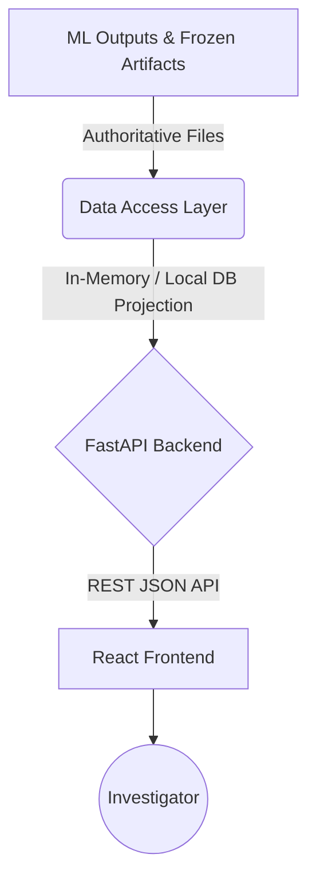

# Feature 12-A: Dashboard Architecture

## 1. Architectural Principles
The Environmental Monitoring Dashboard acts strictly as a **read-only decision-support tool**. It does not execute ML inference, retrain models, or modify source datasets. The architecture enforces a clean separation of concerns between frozen ML artifacts and the investigator presentation layer.

## 2. Component Architecture

### A. Data / ML Outputs Layer
- **Source of Truth**: `data/processed/modeling/candidate_prioritization/` (Feature 11).
- **Format**: `.csv`, `.geojson`, `.json`.
- **Constraint**: Strictly immutable. No writes permitted.

### B. Data Access & API Layer (Backend)
- **Technology**: Python (FastAPI).
- **Rationale**: Python aligns perfectly with the existing data science stack. FastAPI provides high-performance, easily documented read-only endpoints.
- **Data Loading**: On startup, the backend reads the frozen CSV/GeoJSON artifacts into memory (using Pandas/GeoPandas) or a lightweight, read-only ephemeral database (e.g., DuckDB/SQLite). This allows fast SQL-like querying, filtering, and aggregation without requiring a complex, persistent relational database infrastructure.

### C. Dashboard Frontend (Client)
- **Technology**: React (Next.js or Vite).
- **Map Library**: MapLibre GL JS / Leaflet (for robust GeoJSON polygon/point rendering).
- **Visual Framework**: TailwindCSS or Material-UI (clean, professional, government/research-grade aesthetic).
- **Responsibility**: State management, API consumption, data visualization, and map interactions.

## 3. Technology Choices Justification
During repository inspection, no existing frontend, backend, or database infrastructure was found. The project is entirely a Python-based data science repository. 
- **Python/FastAPI** is selected for the backend to minimize context switching and leverage existing Python familiarity. 
- **DuckDB / In-Memory Pandas** is selected for data access to strictly enforce the read-only projection requirement without database administration overhead.
- **React + MapLibre** is selected as the industry standard for performant spatial dashboards.

## 4. Security & Access Considerations
- **Data Sensitivity**: Hotspot coordinates and ML probabilities are sensitive research artifacts.
- **Access Control**: The API layer will require basic authentication or API keys for future iterations.
- **Network Isolation**: The backend server should only expose ports to the frontend server, not directly to the public internet.
